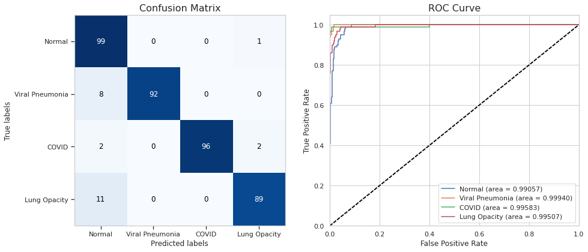

# Detecting COVID-19 with Chest X-Ray

In this repo, I tried to apply deep learning to medical image processing and build a model that identifies COVID-19 infection in radiology images. Residual Network was used and trained on real chest X-Ray images of COVID-19 and healthy patients. The model classifies chest X-Ray images into one of four classes: Normal, Viral, Pneumonio and COVID-19. The trained model was evaluated on 400 actual test subjects and achieved 95% overall accuracy.


## Installation
```bash
$ git clone https://github.com/spacewalk01/detecting-covid19-with-chest-XRay
$ cd detecting-covid19-with-chest-XRay
$ pip install -r requirements.txt
```

## Dataset

COVID-19 radiography dataset can be downloaded from [Kaggle](https://www.kaggle.com/tawsifurrahman/covid19-radiography-database). The dataset contains 3616 COVID-19 positive cases along with 10,192 Normal, 6012 Lung Opacity (Non-COVID lung infection) and 1345 Viral Pneumonia images. The dataset was randomly split into valid(400), test(400) and training(remaining) sets without overlap.

| Class | Meaning |
| :---: | :---: | 
| COVID-19 |  Confirmed positive cases of COVID-19 patients |
| Normal | Healthy people who have no lung infection or disease |
| Viral Pneumonia | [Pneumonia](https://patient.uwhealth.org/healthfacts/5604) is a serious infection in the lungs. It can result from viruses, bacteria, or fungi. Most often, it occurs as a result of a viral illness, such as influenza (flu), measles, or respiratory syncytial virus. |
| Lung Opacity | Lung opacity means pneumonia caused by any previously known pathogen. |

## Results

In this figure, the images are generated from the original training images. Image augmentation is a technique of altering the existing data to create some more data for the model training process. 




## Reference
Coursera, [DeepCOVID](https://github.com/shervinmin/DeepCovid), Deep-COVID: Predicting COVID-19 From Chest X-Ray Images Using Deep Transfer
Learning
